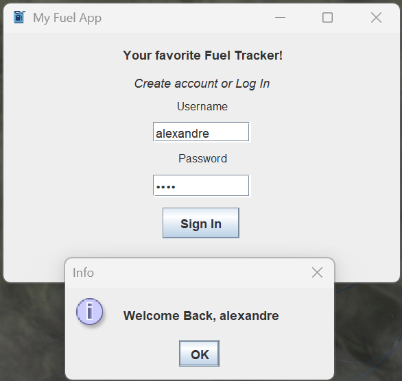
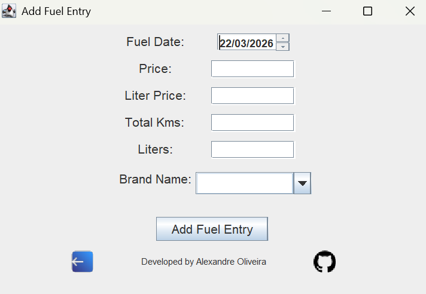
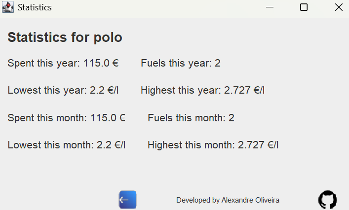
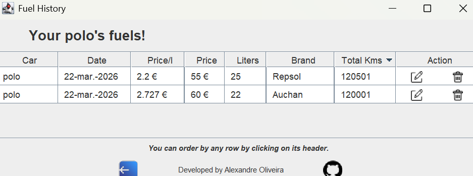
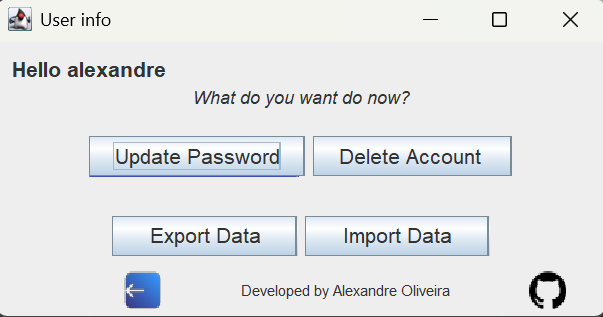
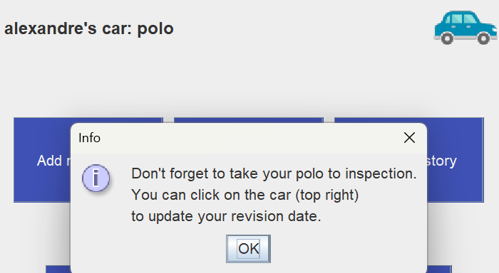

A simple app I've made to learn more and work a bit with Java, and creating an useful app that replaces my current fuel journal.

It has a few features like Stats, History, managing fuels for multiple cars, get reminded of inspections, import and export your data, and others.
You can view the stats and history for your current car or all of them.

It's a small project for fun and curiosity only, any recommendations or bugs found, please tell me.
#

Login screen

Add Fuel

Check Stats

Check Fuel History

User Settings

Inspection warning

#
You can use the repository to build the app, or you can use the exe built by Launch4J.
File is located on /app.

Cheers, Alex